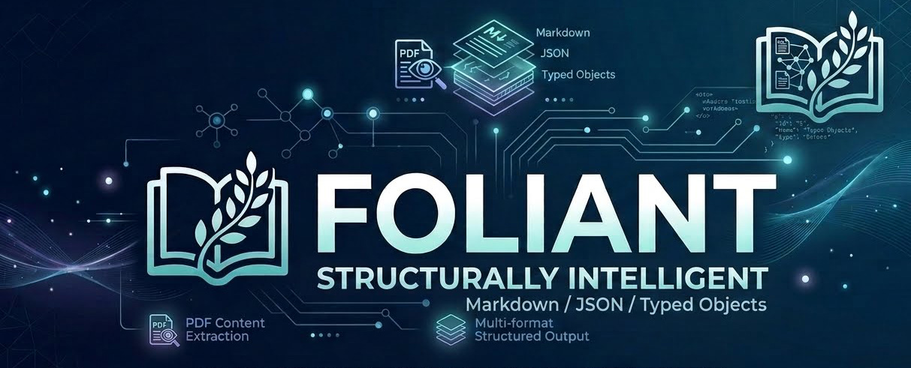

**Layout-aware PDF document AI for .NET — fully local, no Python sidecar, no cloud APIs.**

[](https://www.nuget.org/packages/Foliant.Pipeline)
[](https://github.com/Nerttiyana/Foliant/actions/workflows/ci.yml)
[](LICENSE)

Foliant extracts structured content (Markdown / JSON / typed objects) from PDFs the way
commercial document-intelligence services do — layout detection, per-region OCR,
table-structure recognition, reading-order assembly — running entirely on your machine via
ONNX Runtime. Documents never leave the host.

```csharp
using Foliant.Pipeline;

// Models download once into a local cache (SHA-256 verified), then everything runs offline.
using var processor = await FoliantProcessor.CreateDefaultAsync();
var result = await processor.ProcessAsync(File.ReadAllBytes("document.pdf"));

Console.WriteLine(result.Markdown);          // layout-aware Markdown
string json = result.ToJson(indented: true); // structured regions, tables, bounds, confidence
```

## The gap this fills

Python has a rich open-source document-understanding ecosystem (surya, marker, docling,
unstructured). .NET has excellent text extraction (PdfPig, iText) but essentially nothing
open-source for *layout-aware* understanding: region classification, reading-order inference,
table-structure extraction. Handing whole pages to a general vision-language model produces
plausible-looking output that silently fabricates details — checkbox states, names, field
values — which is disqualifying wherever the answers matter.

Foliant takes the decomposition approach the commercial services use, with open models:

```
PDF page
  → render (PDFium)
  → layout detection                DocLayout-YOLO          what is where
  → text, per region                embedded text layer when present (fast path),
                                    PaddleOCR v5 where pixels are the only source
  → table structure, per region     TableTransformer + ruling-line analysis
  → reading order                   XY-Cut++ (cross-layout masking + density cuts)
  → Markdown / JSON / typed DocumentResult
```

Every stage is an interface in `Foliant.Core` — swap any backend without forking.

## Trust properties

Foliant is built for documents where silent errors are unacceptable, and it treats
verifiability as a feature:

- **Lossless by construction.** A per-page coverage invariant guarantees every extracted line
  provably lands in the output (or is intentional page furniture, reported as such). Across
  **2,303 documents / 65,665 pages** of verification, text loss is **zero**.
- **Self-scoring.** Pages with an embedded text layer are scored against it — the PDF itself
  is the answer key. On the 474-page federal-RFP reference corpus in forced-OCR mode (the
  stringent test, text layer disabled): **99.7% average word recall, 100% of pages ≥95%,
  zero text loss, zero fabricated form values.** See [Test coverage & evidence](#test-coverage--evidence)
  for the full 18-corpus ledger and exactly how each number is computed.
- **Honest about limits.** When the embedded text layer is untrustworthy (legacy
  non-embedded fonts, optimizer-stripped CID fonts) the page is routed to OCR; when content
  is unreachable (dynamic XFA forms whose data lives in an Adobe-only packet) the page is
  flagged, never silently filled with placeholder text. Measured boundaries are documented,
  not hidden.
- **Deterministic.** Same input, same output, every run. No temperature, no sampling.
- **Private by default.** No network calls at processing time; model downloads are the only
  network activity, cache them once and run air-gapped.

## Packages

| Package | Purpose |
|---|---|
| [`Foliant.Pipeline`](https://www.nuget.org/packages/Foliant.Pipeline) | Batteries-included default pipeline — start here |
| [`Foliant.Core`](https://www.nuget.org/packages/Foliant.Core) | Interfaces + DTOs only; depend on this to consume results or author backends |
| [`Foliant.Layout.DocLayoutNet`](https://www.nuget.org/packages/Foliant.Layout.DocLayoutNet) | DocLayout-YOLO layout-detection backend |
| [`Foliant.Ocr.PaddleOcr`](https://www.nuget.org/packages/Foliant.Ocr.PaddleOcr) | PaddleOCR det/rec backend with rotated-text handling |
| [`Foliant.Tables.TableTransformer`](https://www.nuget.org/packages/Foliant.Tables.TableTransformer) | TableTransformer + ruling-grid table-structure backend (default) |
| [`Foliant.Tables.PaddleStructure`](https://www.nuget.org/packages/Foliant.Tables.PaddleStructure) | SLANet-plus table backend for raster/screenshot tables (opt-in) |
| [`Foliant.Models`](https://www.nuget.org/packages/Foliant.Models) | Model catalog + SHA-256-verified local cache |

Model weights (~280 MB) are not inside the packages. They download on first use into the
local cache (`~/.local/share/Foliant/models` on macOS/Linux, `%LocalAppData%\Foliant\models`
on Windows), or pre-fetch with `scripts/download-models.sh` and pass the directory to
`FoliantProcessor.CreateDefault(modelsDir)`.

## Quick start

```bash
dotnet add package Foliant.Pipeline
```

Or run the sample against any PDF:

```bash
git clone https://github.com/Nerttiyana/Foliant.git
cd Foliant
dotnet run -c Release --project samples/Foliant.Sample.Console -- path/to/document.pdf
# → sample-out/document.md + sample-out/document.json
```

**Requirements:** .NET 10 SDK. Windows, macOS, and Linux (x64 + arm64). CPU-only works
everywhere; ONNX Runtime execution providers (CoreML, DirectML, CUDA) are a configuration
option for acceleration.

## Performance

Born-digital pages (embedded text layer) take the fast path: layout from pixels, characters
verbatim from the PDF — about **0.4 s/page** at 300 DPI on Apple-silicon CPU. Full-OCR pages
run around 4 s/page. Throughput scales linearly with cores; no GPU required.

## Test coverage & evidence

Foliant doesn't ship a release without measured quality. Every number below is produced by
the verification harness (`tests/Foliant.Verification`), which writes a per-page
`scorecard.csv` and enforces release gates:

```bash
dotnet run -c Release --project tests/Foliant.Verification -- <pdf-dir>
# → scorecard.csv: per-page recall, coverage, timing, pass/fail against release gates
```

### What was tested

**2,303 documents · 65,665 pages · 18 corpora**, spanning multiple governments and
development banks, many agencies, courts, and forty years of PDF-generation technology —
chosen to be adversarial, not flattering.

By document category:

| Category | Documents | Pages |
|---|--:|--:|
| Government & tax forms (public blank forms) | 1,215 | 9,586 |
| RFP / solicitation & procurement packages (federal + intl. bank IFB/ICB) | 439 | 15,202 |
| Complex fillable forms (FDA, insurance, dental — AcroForm/XFA) | 144 | 938 |
| Academic ebooks (multi-column) | 101 | 23,971 |
| Consumer magazines | 34 | 3,552 |
| Newspapers (incl. multi-column Devanagari) | 75 | 883 |
| Federal rulemaking dockets (regulations.gov) | 169 | 9,591 |
| Court judgements & legal filings | 126 | 1,942 |
| **Total** | **2,303** | **65,665** |

By page layout (from layout-classified corpora): multi-column **~907**, single-column /
simple **~220**, dense form/table grids **~110**, and image-only / scanned **~182** sampled
pages — i.e. the suite deliberately over-weights the multi-column and form layouts that
break naive extractors. Of the complex-forms corpus, **126 of 144** are interactive AcroForm
documents and **102** carry XFA, including **19 dynamic-XFA** forms whose content is reachable
only by an Adobe engine (detected and flagged, never faked).

### How each score is computed

Every metric is mechanical and reproducible from the PDF itself or from a small hand-labeled
truth file — no model grades its own homework.

- **Word recall (Gate 1).** The PDF's embedded text layer is the answer key. Both the answer
  key and the extracted output are tokenized into words (length ≥ 3, alphanumeric-normalized,
  case-folded); recall = (truth words found in output) ÷ (total truth words). Reported
  per page and averaged. *Default mode* measures fidelity — that the pipeline carries the
  born-digital text through layout, reading-order and composition without dropping it.
  *Forced-OCR mode* (`--ocr-only`, text layer disabled) is the stringent, non-circular test:
  it scores real OCR output against the text layer, so the answer can genuinely diverge. The
  headline **99.7%** is forced-OCR on the reference corpus.
- **Zero text loss (Gate 2).** A structural coverage invariant: every extracted line must
  appear in the output or be explicitly classified as page furniture (header/footer/page
  number). The harness counts lines that are neither — that count must be **0**. This makes
  "silently dropped text" impossible by construction, independent of recall.
- **Reading-order correctness (Gate 6).** Kendall's τ between a hand-verified reading order
  and the order the same snippets appear in the output. τ = (concordant − discordant pairs) ÷
  total pairs: 1.0 is perfect, 0 is uncorrelated. Measured on 50 hand-verified pages.
- **Form-field truthfulness (Gate 3).** Hand-labeled field values and checkbox states;
  the bar is **zero fabrication** — a wrong "checked" is disqualifying. Current: 48/48 fields,
  zero fabricated.
- **Table-cell correctness (Gate 5).** Hand-labeled cells matched against extracted table
  structure, per table.

### The evidence ledger

Per-corpus results (default mode unless noted; "loss" is the Gate 2 line-loss count):

| Corpus (category) | Docs | Pages | Word recall | Pages ≥95% | Text loss |
|---|--:|--:|--:|--:|--:|
| Federal RFP solicitations — reference *(forced-OCR)* | 13 | 474 | **99.7%** | 100% | 0 |
| US tax forms | 51 | 609 | 100.0% | 100% | 0 |
| Security questionnaires / gov forms | 111 | 545 | 100.0% | 100% | 0 |
| Federal solicitations (stamped/watermarked) | 19 | 309 | 99.1% | 96.8% | 0 |
| Indian government forms | 119 | 227 | 99.5% | 99.0% | 0 |
| US Treasury / Justice federal forms | 524 | 7,283 | 99.9% | 99.9% | 0 |
| SAM.gov solicitation attachments | 80 | 642 | 100.0% | 100% | 0 |
| Public government forms (set 8) | 141 | 406 | 100.0% | 100% | 0 |
| Public government forms (set 9) | 269 | 516 | 100.0% | 100% | 0 |
| Academic ebooks (multi-column) | 101 | 23,971 | 99.9% | 99.8% | 0 |
| Consumer magazines (image-heavy) | 14 | 1,386 | 100.0% | 99.9% | 0 |
| FDA / insurance / dental claim forms | 144 | 938 | 100.0% | 100% | 0 |
| Newspapers (incl. Devanagari) | 75 | 883 | 99.9% | 99.7% | 0 |
| RFP / procurement bid packages (IFB/ICB, set 16) | 71 | 6,167 | 100.0% | 100% | 0 |
| Federal solicitations — SEWP RFP + amendments (set 17) | 256 | 7,610 | 100.0% | 100% | 0 |
| Federal rulemaking dockets — regulations.gov (set 18) | 169 | 9,591 | 100.0% | 100% | 0 |
| Supreme Court of India judgements (set 20) | 126 | 1,942 | 100.0% | 100% | 0 |

Reading order (Gate 6, Kendall's τ on hand-verified pages): **academic ebooks 0.967**,
**consumer magazines 0.962** — measured after adopting XY-Cut++, which corrected the
column-interleaving that plain XY-cut produces on aligned multi-column pages.

### Measured boundaries (reported, not hidden)

Rigor means publishing where the method stops working:

- **Optimizer-corrupted text layers.** One 20-document magazine set was re-saved through a
  "PDF optimizer" that stripped the fonts' Unicode maps, so the embedded text is undecodable
  glyph codes. Foliant now detects this and routes those pages to OCR, producing correct
  output — but the *recall metric itself is undefined there*, because its answer key (the text
  layer) is the corrupted data. Those pages are therefore excluded from the recall ledger
  rather than reported with a misleading number.
- **Dynamic XFA forms (19 pages).** Content lives in an XFA packet that no non-Adobe engine —
  and therefore no OCR — can reach. Detected and flagged with an explicit notice; never filled
  with the "Please wait" placeholder.
- **Semantic reading order.** Numbered step-grids and tip mosaics read in *number* order, a
  cue no geometric method can see; kept as documented boundary cases outside the τ average.
- **Newspapers as a reading-order benchmark.** Multi-article pages have no single linear
  order, so they are scored for extraction fidelity (99.9%) but not for a global reading-order
  τ.
- **Non-Latin scripts.** Recognition beyond English is roadmap; the Devanagari newspapers
  validate layout and the text-layer fast path, not OCR recognition of Indic scripts.

Run the harness on *your* corpus before adopting — if Foliant underperforms on your
documents, that's a bug report we want.

## Repository layout

```
src/        shipping packages (Core, Pipeline, backends, Models)
tests/      unit tests + the verification/scorecard harness
samples/    console sample (ASP.NET and Blazor samples planned)
spike/      Phase 0 throwaway prototype + measured results (RESULTS.md) — kept for history
scripts/    model download helper
```

Scanned pages routed to OCR get deterministic preprocessing automatically: deskew (±8°),
contrast normalization for faded scans, and despeckling (`ProcessingOptions.PreprocessScans`).

Scanned pages also report their estimated *effective* resolution: `PageResult.EffectiveDpi` is
the native pixel size of the page's scan image relative to its physical size (not the fixed render
DPI), and `PageResult.LowResolution` flags pages below `ProcessingOptions.MinScanDpi` (default 150)
so callers can surface low-confidence scans. Advisory only — the page's Markdown is still produced.
An `IScanUpscaler` seam (`ProcessingOptions.UpscaleLowResolutionScans`) can upscale flagged pages
before OCR, but the default pipeline wires no upscaler: the Gate 8 ledger measured classical
(bicubic) upscaling as net-negative for recall, so the seam is reserved for a future ML
super-resolution backend rather than enabled by default.

## Roadmap

Shipped in 0.6.0: typed key-value **form-field extraction** (`PageResult.FormFields`) — exact
values from fillable AcroForm PDFs, plus a deterministic, label-anchored *geometric* path for
flattened forms via caller-supplied `FormProfile`s, behind the `IFormFieldExtractor` seam. Opt-in
(`ProcessingOptions.ExtractFormFields`); measured zero-fabrication on the sample SF-33 profile.

Shipped in 0.5.0: low-resolution scan warning (`PageResult.EffectiveDpi` / `LowResolution`),
orientation-detection refinement (confidence + word-diversity guards that stop decorative-page
misfires), enumerator-aware reading order for numbered mosaics (opt-in), and the 1.0 API
stability review (see [`API-STABILITY.md`](API-STABILITY.md)). Earlier: scanned-document support
with coarse-orientation correction (0.4.0), watermark/stamp suppression, XY-Cut++ reading order,
and text-layer trust guards (legacy non-embedded fonts, optimizer-corrupted CID fonts, dynamic-XFA).

Measured and parked: classical (bicubic) super-resolution was measured net-negative for OCR recall
on low-DPI scans (Gate 8) and is off by default; ML super-resolution is deferred to a GPU path. An
ML form-understanding model (LayoutLMv3 / XFUND) is the deferred lever for arbitrary, non-profiled
forms. The `IScanUpscaler` and `IFormFieldExtractor` seams are in place for both.

Next:

- Languages beyond English (PaddleOCR multilingual recognition models)
- Internationalize form-field extraction (right-to-left and vertical scripts, non-Latin marks) —
  on top of multilingual OCR; Foliant is a general library, not a US-forms tool
- Post-OCR language-model correction (local, optional)
- Page de-warp; GPU-path ML super-resolution; ML form understanding for the open-ended long tail
- Additional backends (`Foliant.Ocr.Tesseract`; community backends welcome — the
  interfaces are the contract, no central gatekeeping)

`IDocumentProcessor` and the `Foliant.Core` contracts are treated as stable from 1.0;
backends iterate freely. The full public contract, extension points, and semver policy are
documented in [`API-STABILITY.md`](API-STABILITY.md).

## Built on

[ONNX Runtime](https://onnxruntime.ai/) ·
[DocLayout-YOLO](https://github.com/opendatalab/DocLayout-YOLO) (Apache 2.0) ·
[PaddleOCR](https://github.com/PaddlePaddle/PaddleOCR) (Apache 2.0) ·
[TableTransformer](https://github.com/microsoft/table-transformer) (MIT) ·
[PDFtoImage](https://github.com/sungaila/PDFtoImage) / PDFium ·
[PdfPig](https://github.com/UglyToad/PdfPig)

## License

[Apache 2.0](LICENSE)
